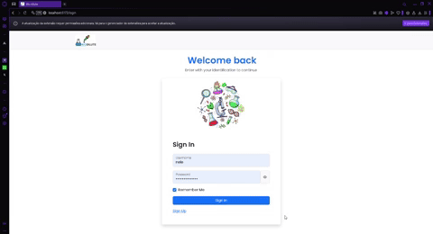
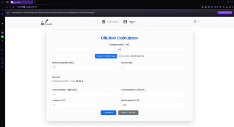

## 🧪 Bio Dilute — Organize Experimentos e Calcule Diluições com Facilidade

### Descrição do Projeto
Bio Dilute é uma aplicação fullstack desenvolvida para uma aluna de doutorado do Instituto de Ciências Biomédicas da USP, com o objetivo de automatizar, organizar e documentar experimentos de diluição em ambiente laboratorial.

Embora tenha sido criada inicialmente para uso individual, a aplicação foi expandida para oferecer suporte a múltiplos usuários, com a implementação de um sistema completo de login e autenticação, permitindo que outros estudantes do laboratório também utilizem a ferramenta de forma personalizada e segura.
As principais funcionalidades incluem um gerenciador de experimentos, onde os usuários podem salvar e consultar seus registros, e uma calculadora de diluição baseada na fórmula C₁ · V₁ = C₂ · V₂. com cálculo automático de molaridade via integração com a API do PubChem. 
Desta forma, isso tudo elimina a necessidade de consultas manuais e aumenta a agilidade e precisão na preparação das soluções.

### Funcionalidades Principais:

📁 Gerenciamento de Experimentos

🧪 Calculadora de Diluição com suporte à API PubChem

🔐 Login com suporte a múltiplos usuários

⏱️ Automação de cálculos e registros

📊 Centralização digital de dados experimentais 

### 🛠️ Tecnologias Utilizadas
** Back-end:** 
- Java.
- Spring Boot Web (construção da API REST).
- Spring Security (filtros de segurança — autenticação e autorização).
- JWT (JSON Web Token — autenticação baseada em tokens). 
- PostgreSQL (banco de dados relacional)

**Front-end:** 
- React (com uso de useContext e React Router para gerenciamento de estado e rotas).
- JavaScript / HTML / CSS, Bootstrap (componentes visuais e responsivos).
- Axios (requisições para API interna e API externa – Chemistry API)
- Vite (Rodar o servidor)

### Como Rodar o Projeto
**Backend — Java + Spring Boot** 

A partir da raiz do projeto backend (back-end\biodilute), digite na linha de comando:

```bash
./mvnw spring-boot:run
```
**Frontend — React + Vite**

A partir da pasta do front-end (/front-end/bio-dilute):
```bash
npm run dev
```

### Demonstração básica da aplicação



### Leia os READMEs de cada pasta para instruções detalhadas:
- [Frontend - Vite + React](./front-end/bio-dilute/README.md) 
- [Backend - Java (Spring)](./back-end/biodilute/README.md)

### Licença
Este projeto está sob a licença Matheus.

### Autor
- [@matheuslssouza](https://www.github.com/matheuslssouza)
- Nome: Matheus Souza   
- LinkedIn: [linkedin.com/in/matheuslssouza](https://linkedin.com/in/matheuslssouza)
