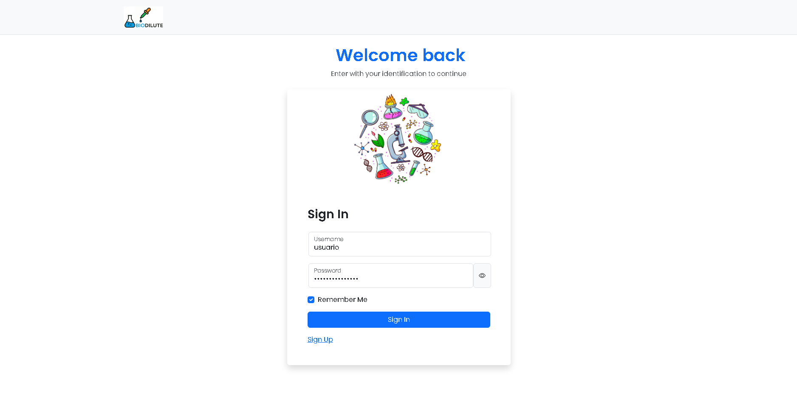
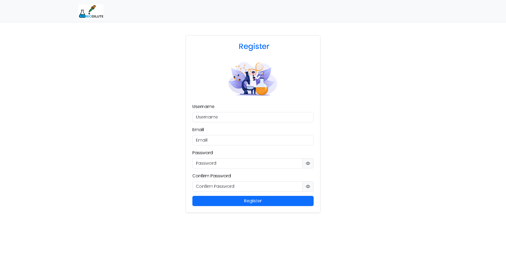
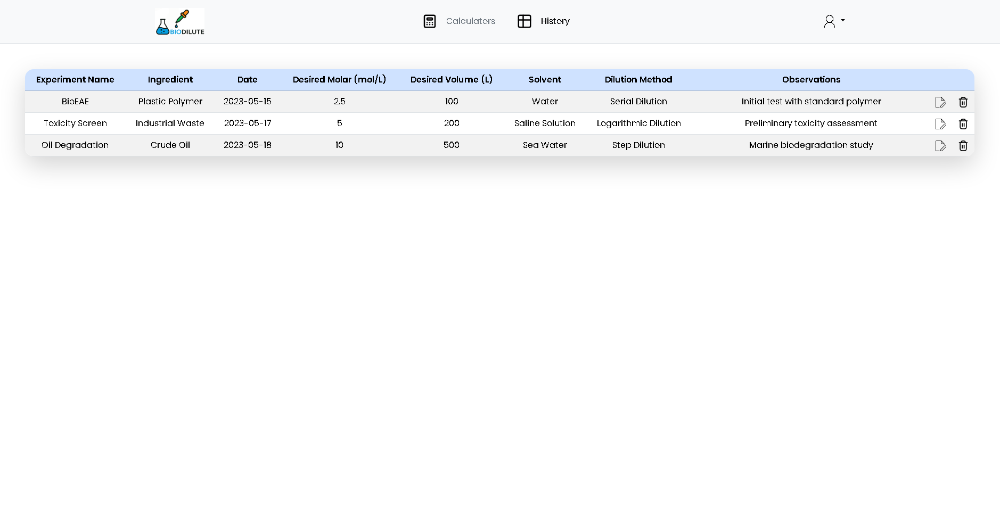
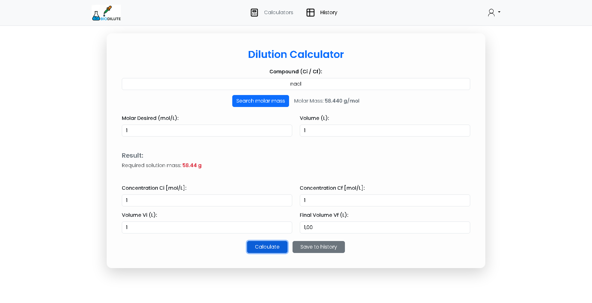

## 🧪 Bio Dilute — Organize Experimentos e Calcule Diluições com Facilidade

### Descrição do Projeto
Bio Dilute é uma aplicação fullstack desenvolvida para automatizar, organizar e documentar experimentos de diluição em um laboratório. Inicialmente criada para uso individual, a aplicação foi expandida para suportar múltiplos usuários com login e autenticação. Suas principais funcionalidades incluem um gerenciador de experimentos e uma calculadora de diluição baseada na fórmula C₁ · V₁ = C₂ · V₂, com cálculo automático de molaridade via API do PubChem, agilizando e tornando mais precisos os processos de preparação de soluções. 

*Os detalhes referentes ao desenvolvimento do front-end da aplicação estão apresentado abaixo!*


### ⚙️ Ferramentas Utilizadas:
- React (com uso de useContext e React Router para gerenciamento de estado e rotas).
- JavaScript / HTML / CSS, Bootstrap (componentes visuais e responsivos).
- Axios (requisições para API interna e API externa – Chemistry API)

------------------------------------------------------------------------------------------------------------------

### 🎨 Layout da aplicação:

<p align="center">
    
   
   
  
</p>


------------------------------------------------------------------------------------------------------------------

### 📂 Estrutura do Projeto
A distribuição das pastas seguiu da seguinte maneira:

- **components** - Componentes reutilizáveis
- **context** - Contexto de autenticação do React (ex: AuthContext)
- **hooks** - Hooks customizados
- **modals** - Componentes de modais
- **pages** - Páginas principais da aplicação
- **routes** - Arquivos de definição das rotas da aplicação
- **services** - Integração com APIs

## Paths:

### Rotas públicas

#### GET /register:
```html
/register
```
Página de registro de um novo usuário.

#### GET /login:
```html
/login
```
Página de login do usuário.

### Rotas privadas

#### GET /:
```html
/
```
Página da calculadora de diluição e modal para inserção de novos experimentos.

#### GET /history:
```html
/login
```
Página contendo tabela com o histórico de experimentos.

------------------------------------------------------------------------------------------------------------------

### 📚 Lições Aprendidas
Tecnologias Utilizadas:

**React Context API:** Usa-se para compartilhar dados entre componentes. Na aplicação foi utilizado para gerenciamento global do estado de autenticação.

**React Hooks (useState, useEffect, useContext):** Para gerenciamento de estado e efeitos colaterais no React. Na aplicação, mais especificamente foi utilizado um useEffect que quando alterado o token, era realizado um fetch a rota /auth/verify, para verificar a validação do token.

**localStorage:**  Utilizado para armazenar dados no navegador, como o token JWT, e permite que esses dados persistam entre sessões. Com o uso de JWT, a autenticação se torna stateless, ou seja, o servidor não armazena informações de sessão. O token JWT carrega as informações de autenticação e autorização, e o cliente (navegador) é responsável por enviá-lo em cada requisição subsequente. Assim, o servidor não precisa manter o estado da sessão, já que as informações de autenticação estão no próprio token.

------------------------------------------------------------------------------------------------------------------

### Aprendizados:

Inicialmente, o maior problema estava relacionado a autenticação, desta forma foi desenvolvido um Contexto para compartilhar os dados de autenticação, incluindo as variáveis isAuthLoading, isAuthenticate, e as funções login(), logout(), entre outras. A variável isAuthenticate foi utilizada no arquivo de rotas para determinar se o caminho requisitado pelo navegador seria renderizado ou não. A lógica adotada estipulava que, caso o usuário estivesse autenticado, o componente <Outlet> prosseguiria com o carregamento da rota desejada. Caso contrário, o usuário seria redirecionado para a página de login (/login). Para garantir que nenhuma tela fosse renderizada enquanto a autenticação estava sendo verificada, foi criada a variável isAuthLoading, a qual, quando true, impedia a renderização do componente.

------------------------------------------------------------------------------------------------------------------

**1. Estrutura do Contexto de Autenticação**

Utilizei a React Context API para criar um contexto de autenticação que pode ser acessado em qualquer componente da aplicação. O AuthContext gerencia os seguintes estados:

isAuthLoading: Um estado que controla se o processo de verificação do token está em andamento. Isso ajuda a garantir que a aplicação não exiba componentes dependentes da autenticação enquanto está verificando a validade do token.

isAuthenticated: Indica se o usuário está autenticado com base na validade do token JWT.

token: Armazena o token JWT, que é recuperado do localStorage.

------------------------------------------------------------------------------------------------------------------

**2. Funções de Login e Logout**

A camada de autenticação possui duas funções principais: login e logout, que são responsáveis por gerenciar a sessão do usuário:

```javascript
login(tokenParam):
```

Quando o usuário faz login, o token JWT recebido da API é armazenado no localStorage para persistência entre as sessões.

O estado do token e isAuthenticated é atualizado, sinalizando que o usuário está autenticado.

```javascript
logout():
```

Quando o usuário faz logout, o token JWT é removido do localStorage.

O estado do token e isAuthenticated é resetado para indicar que o usuário não está mais autenticado.

------------------------------------------------------------------------------------------------------------------

**3. Verificação do Token JWT**

A função useEffect é usada para verificar se o token JWT ainda é válido a cada vez que o token muda. Essa verificação é feita enviando o token para a API de backend no endpoint /auth/verify. O backend então responde indicando se o token é válido. Com base nessa resposta, a aplicação decide se mantém o estado de autenticação ou se realiza o logout.

Verificação assíncrona do token:

O token JWT é enviado no cabeçalho da requisição como Authorization: Bearer <jwt_token>.

O backend valida o token e retorna um estado de autenticação.

Se o token for válido, o estado de isAuthenticated é atualizado para true.

Se o token for inválido, o logout é executado, removendo o token e desautenticando o usuário.

------------------------------------------------------------------------------------------------------------------

**4. Integrando com os Componentes**
Este contexto de autenticação pode ser utilizado em qualquer componente dentro da aplicação, permitindo que a verificação de autenticação seja centralizada e de fácil acesso.

```javascript
useAuth()
```
Hook customizado que permite acessar o contexto de autenticação. Esse hook é usado em componentes para verificar se o usuário está autenticado ou não e acessar o token JWT necessário para realizar requisições protegidas. 

Exemplo:

```javascript
const { isAuthenticated, login, logout } = useAuth();
```
------------------------------------------------------------------------------------------------------------------

**5. Resumo dos fluxos**

**Fluxo de Autenticação**

Login: Quando o usuário realiza o login, o token é armazenado e a autenticação é atualizada.

Verificação: A cada alteração no token, a aplicação verifica se o token é válido ao fazer uma requisição para o backend.

Logout: Quando o usuário se desloga, o token é removido e o estado de autenticação é atualizado para refletir que o usuário não está mais autenticado.

------------------------------------------------------------------------------------------------------------------

### Licença
Este projeto está sob a licença Matheus.

### Autor
- [@matheuslssouza](https://www.github.com/matheuslssouza)
- Nome: Matheus Souza   
- LinkedIn: [linkedin.com/in/matheuslssouza](https://linkedin.com/in/matheuslssouza)
